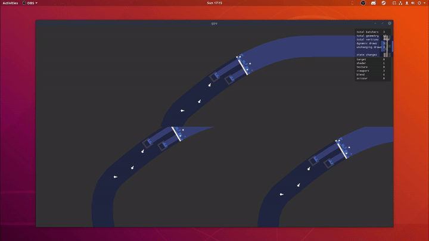

# Flurry

Flurry is a cross platform, 2D focused game engine written in the Haxe language. It currently supports Windows, Mac, and Linux with Web and WinRT / XBox support planned.
This engine is currently WIP so nothing is set in stone or stable.

## Features

* Multiple Rendering Backends
    - OpenGL 4.5 backend takes use of persistently mapped buffers, bindless textures, SSBOs, and many other modern OpenGL techniques. This backend should be the fastest but also least supported (OSX and many intel iGPUs do not have OpenGL 4.5 support, AMDs Windows GL driver is also really bad).
    - Directx 11 will give good performance to pretty much all hardware on windows.
    - WebGL / GLES backend is a fallback for very old hardware, OSX, and web targets.

* First Class Shader Support
    GLSL and HLSL shaders are fully supported.
    
* Batched Drawing
    Geometries are batched together to minimise draw calls.

* Sample Project Provided
    Handful of samples provided to show you how to get things drawing. More samples and guides / documentations on the way!

## Planned Features

* Web Target
    WebGL rendering backend already ready but some parts of the engine require some reworking as they require thread and file system access.
    
* WinRT / Xbox
    DX11 backend can be easily adapted to support WinRT, HxCPP also already supports WinRT. This should also give access to Xbox One development
    
* Vulkan Backend
    A Vulkan backend is planned, MoltenVK could be used to give the Mac better performance than just GLES.
    
* Other Stuff
    More planned features can be found on the project page https://github.com/Aidan63/Flurry/projects/1
    
## Dependencies
- snow
- linc_opengl (https://github.com/Aidan63/linc_opengl)
- linc_directx (https://github.com/Aidan63/linc_directx)
- linc_openal
- linc_stb
- linc_stb
- linc_ogg
- linc_sdl
- linc_imgui
- haxe_concurrent
- haxe_strings
